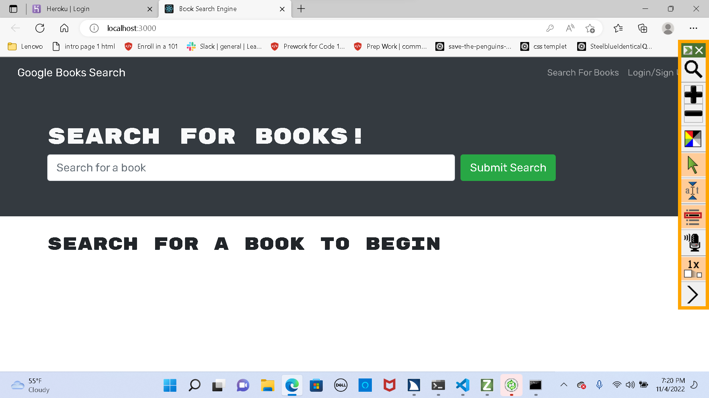

# MERN- Book- Engine-21

## Description

This is a MERN stack application that uses Mongodb for database, node.js, express.js, and React for front end.

## Table of Contents

- [installation](#installation)
- [Usage](#usage)
- [License](#license)
- [Contribution](#contribution)
- [Tests](#test)
- [Questions](#questions)

## Installation/Technologies

NPM Apollo Client Package
NPM Apollo-Server-Express Package
NPM GraphQL Package
NPM Bcrypt Package
NPM Express.js Package
NPM JSONWebToken
NPM Mongoose Package
Node.js
NPM nodemon Package
NPM JWT-Decode Package
NPM React Package
NPM React-Bootstrap
React-Dom
React-Router-Dom
React-Scripts
## License

  This application is licensed under [GNU](https://www.gnu.org/licenses/licenses.en.html).

## Contribution

University of Washington coding bootcamp challenge assignment

## Test

To test thisapplication, please clone the repo and install the necessary npm dependencies. Type "npm run develop" from root directery of application
  For code review go to the [Github  repo](https://github.com/teshome28sara/MERN-Bookk-Engine-21)
 For deployed site go to  [Tech Blog](https://peaceful-sands-79641.herokuapp.com/)

## Questions
 tes28sar@gmail.com 

 ###  Desktop  Screenshot

 

